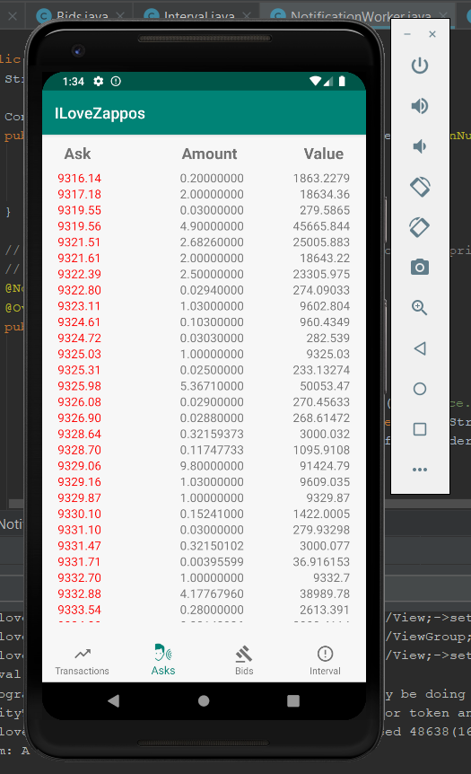
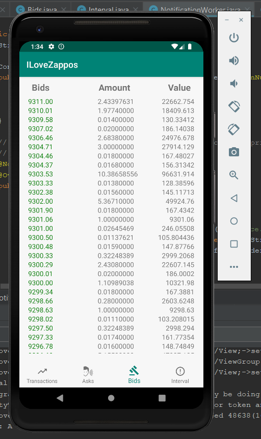
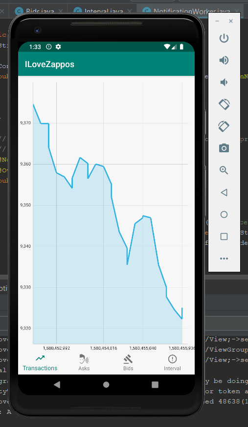
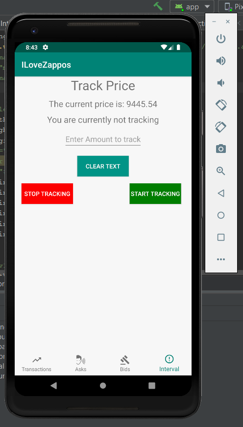
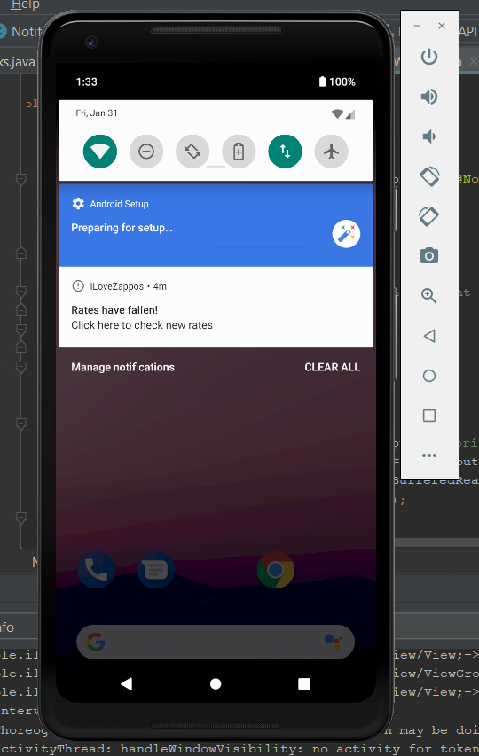

# CoinTracker
A native android app written in Java that has the following functionalities:
1. Fetch the price history over time and display a line graph of the same.
2. Displays two tables (Recycler View) of order book information (bids and asks)
3. Takes price input from the user and stores it in a text file. Pings the api every hour using a service and displays a notification
   if the current bitcoin price has fallen below the specified price entered by the user.
   
## Bonuses Covered:
1. Used retrofit to handle the REST requests
2. Used animations for the graph as well as the Recycler views
3. Followed material design guidelines to a certain extent
   
### Asks 

### Bids

### Transactions

### Set Price

### Notification Displayed

## Improvements
1. Could handle configuration changes
2. Could use RxJava
3. Could implement the app in kotlin

###### App Icon made by Pixel perfect from www.flaticon.com
